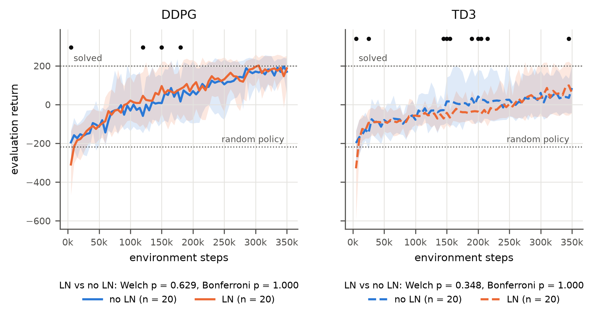
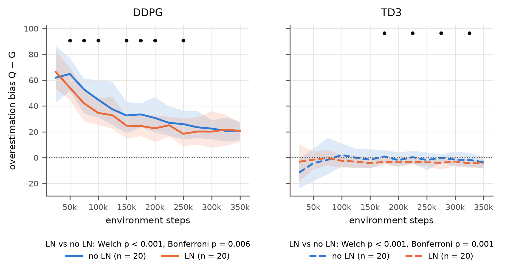

# LayerNorm, Overestimation Bias and Performance in DDPG and TD3

Does **Layer Normalization** reduce the critic's **overestimation bias** in DDPG and TD3, and does a lower bias lead to **better performance**? An empirical study on `LunarLanderContinuous-v3`: 80 runs (2 algorithms × with/without LN × 20 seeds), bias measured against Monte-Carlo returns, Welch's t-tests with Bonferroni correction.

*Course project, reinforcement learning, Sorbonne Université (M2), built with [`rl-mind`](https://master-dac.isir.upmc.fr/rl/rl-mind/).*

## Key findings

- **LN lowers the critic's value estimates** in both algorithms: DDPG −4.9 [−7.4, −2.3], TD3 −2.8 [−4.0, −1.6] (Bonferroni-corrected p = 0.006 and 0.001).
- **LN has no detectable effect on performance**: DDPG +5.5 [−16.1, 27.7], TD3 +21.9 [−20.5, 66.1].
- **Removing overestimation does not help**: TD3 nearly eliminates the bias but performs much worse than DDPG (−129, p < 0.001), and within each configuration bias and performance are unrelated.




## Setup

- DDPG (course variant, no target actor) and TD3, same hyper-parameters for both: τ = 0.05, 64×64 networks (selected by grid search), γ = 0.98, Adam 1e-3, 350k steps.
- LayerNorm after every hidden layer of the actor and critic.
- Bias = mean Q(s, π(s)) minus the discounted Monte-Carlo return, every 25k steps, corrected for time-limit truncation.

## Repository

```
src/        config, networks, exploration noise, bias measurement, DDPG/TD3 training loops
scripts/    train.py (one run), run_hp_search.sh, run_final_runs.sh, analyze_*.py
results/    raw JSON of every run, grid search, figures and test tables
```

## Reproduce

```bash
uv sync
uv run python scripts/train.py --algo td3 --seed 15 --layernorm   # one run (~12 min on CPU)
N_JOBS=4 THREADS=1 ./scripts/run_final_runs.sh                    # 80 final runs, resumable
uv run python scripts/analyze_final_runs.py                       # figures and tests
```

## Authors

Youssef Hamzaoui and Martin Delamare, Sorbonne Université.